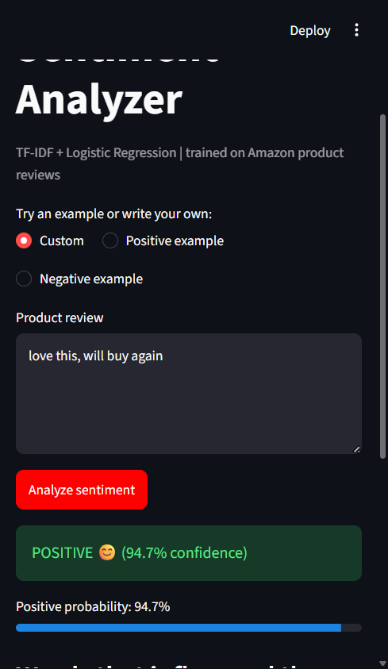
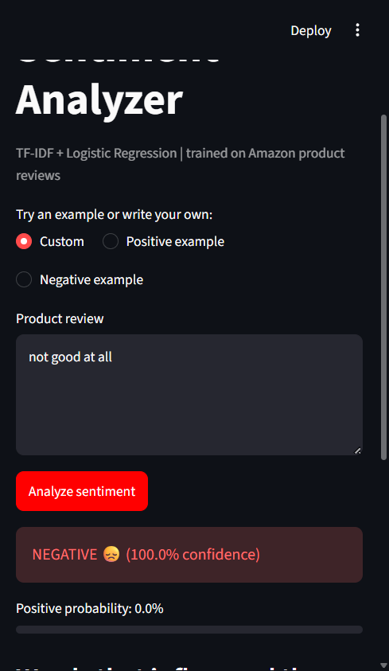
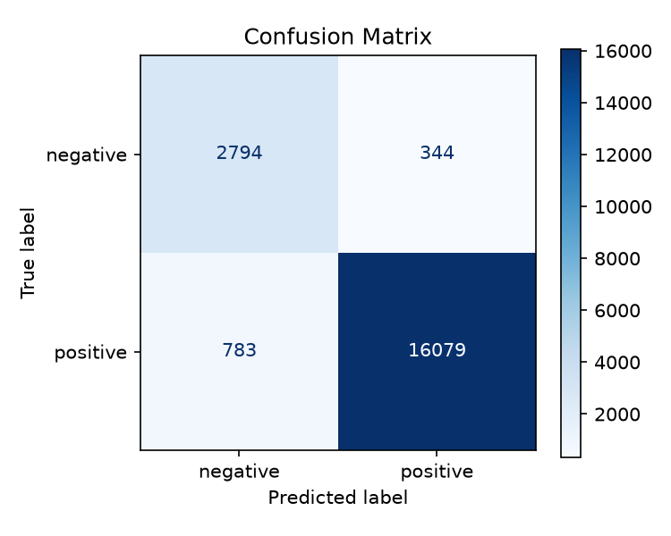
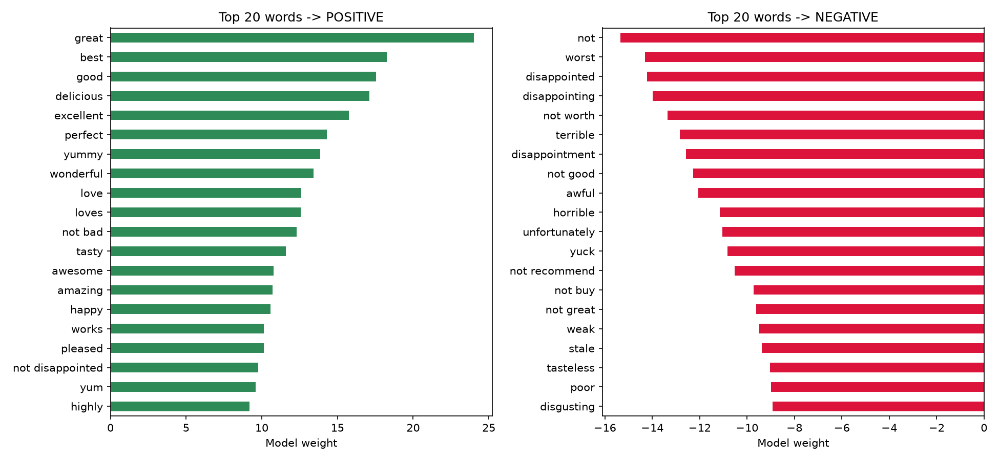

# 🛒 Amazon Product Review Sentiment Analyzer

Sentiment analysis of Amazon product reviews using **TF-IDF** and **Logistic Regression**, with a **Streamlit** app for real-time predictions.

## Overview
The project classifies a product review as **positive** or **negative**. Reviews are cleaned, converted to numeric features with TF-IDF (unigrams + bigrams), and classified with Logistic Regression. The app also shows which words pushed each prediction toward positive or negative.

## Dataset
[Amazon Fine Food Reviews (Kaggle)](https://www.kaggle.com/datasets/snap/amazon-fine-food-reviews): 500K+ reviews with 1-5 star ratings.
- 4-5 stars = **positive**, 1-2 stars = **negative**, 3 stars dropped (ambiguous)
- Review title + body are combined as input
- 100K reviews sampled for fast training (configurable)
- The CSV is expected in `data/Reviews.csv` and the script also falls back to the project root for compatibility

## Results
| Metric | Score |
|--------|-------|
| Accuracy | 94.4% |
| Macro F1 | 0.90 |
| Negative-class recall | 0.89 |

### Screenshot examples





### Model evaluation charts





## Key Design Decisions
- **Class imbalance:** ~80% of reviews are positive, so I used `class_weight="balanced"` and report **macro F1** and per-class recall instead of accuracy alone.
- **Negation handling:** the default English stopword list removes "not" and "never", so I kept negation words so that "not good" stays distinct from "good" (bigrams capture it).
- **Interpretability:** top positive and negative words come from the model coefficients.

## Tech Stack
Python, Pandas, Scikit-learn, Matplotlib, Streamlit

## Project Structure
```
amazon-sentiment/
├── app.py                # Streamlit app
├── Reviews.csv           # dataset can live here (or inside data/)
├── src/
│   ├── text_utils.py     # text cleaning
│   └── train.py          # training + evaluation
├── data/                 # optional alternate dataset folder
├── models/               # saved model (created by train.py)
├── reports/              # metrics and charts (created by train.py)
└── requirements.txt
```

## How to Run
```bash
pip install -r requirements.txt

# 1. Download "Amazon Fine Food Reviews" from Kaggle
#    and save Reviews.csv at the project root or inside data/

# 2. Train and evaluate (use --sample 0 for all reviews)
python src/train.py --data Reviews.csv --sample 100000

# 3. Launch the app
streamlit run app.py
```


